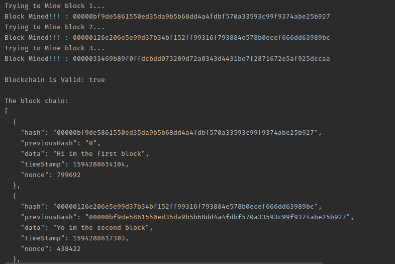

# Project Details
This is a project that at the very basic level will implement blockchain and currently
mine cryptocurrency

## Why I started the project ?
Cryptocurrency is something that has always fascinated me, an application that will allow
you to mine money through your computer and its ability to change the whole way the banking
system works currently, therefore I started to learn more about it.

## Making a blockchain
Before implementing the project one has to understand how blockchain works.  
  
A blockchain is just a chain/list of blocks. Each block in the blockchain will 
have its own digital fingerprint, contain a digital fingerprint of the previous block, 
and have some data ( this data could be transactions for example ).
  
Hash = Digital Fingerprint.    
  
Each block doesn’t just contain the hash of the block before it, but its own hash is in 
part, calculated from the previous hash. If the previous block’s data is changed 
then the previous block’s hash will change ( since it is calculated in part, by the data)
 in turn affecting all the hashes of the blocks thereafter. Calculating and comparing 
 the hashes allow us to see if a blockchain is invalid.
  
    
The Cryptographic algorithm used in this is SHA256.
  
  
#### Dependencies
* gson gson-2.8.2.jar

#### Working
